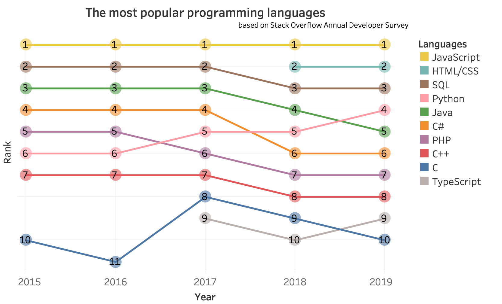
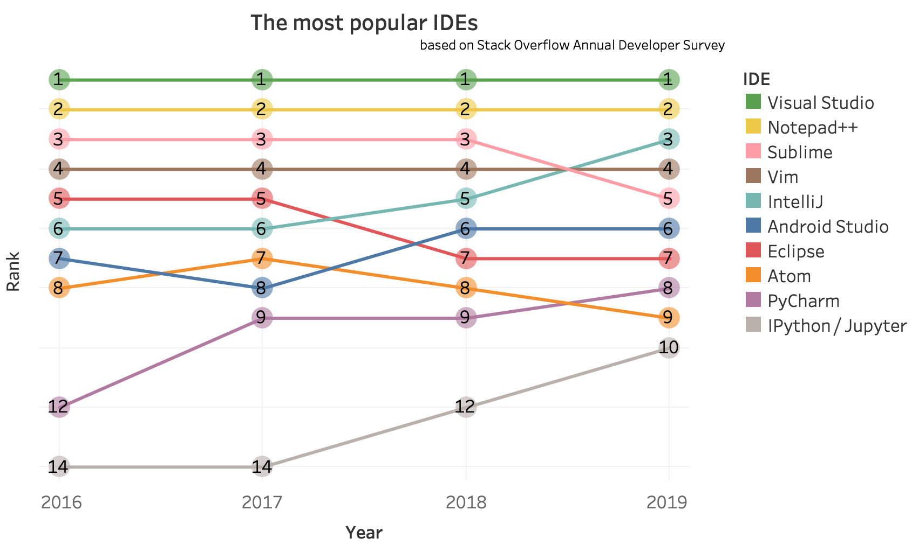
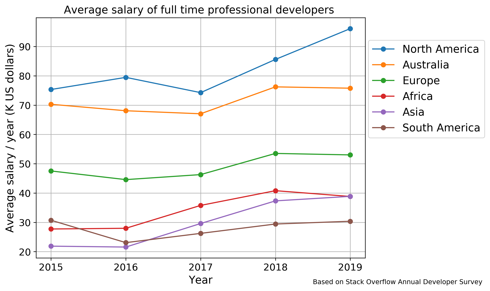
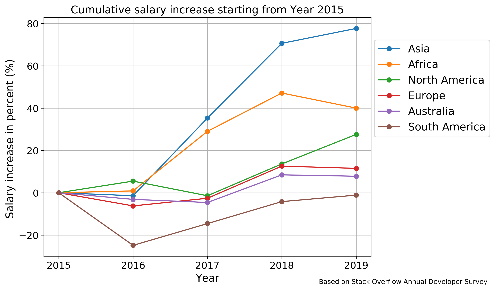

# Analysis of the Stack Overflow Annual Developer Survey

## Table of Contents

1. [Installation](#installation)
2. [Project Motivation](#motivation)
3. [File Descriptions](#file)
4. [Technical Details](#technical)
5. [Conclusions](#conclusions)
6. [Licensing and Acknowledgements](#licensing)

## Installation 
The Jupyter notebook in this project is based on Python 3.6.4. You will need packages such as numpy, pandas, matplotlib, pycountry_convert to run this notebook. The package pycountry_convert is used to convert country names to continent names.
After downloading the repository to your local machine, you will need to unzip the data.zip file before running the Stack_Overflow_survey_project.ipynb.
The file structure should be as follows:
> repository/  
&emsp;&emsp;Stack_Overflow_survey_project.ipynb  
&emsp;&emsp;data/  
&emsp;&emsp;images/  
&emsp;&emsp;stackoverflow_ide.twb  
&emsp;&emsp;stackoverflow_programming languages.twb  
&emsp;&emsp;IDE.xlsx  
&emsp;&emsp;language.xlsx  
&emsp;&emsp;README.md

## Project Motivation 
This project tries to answer the following questions using the the [Stack Overflow Annual Developer Survey](https://insights.stackoverflow.com/survey) dataset.
- What is the most popular programming language in the past five years? Is there any trend?
- What is the most popular IDE for professional software developers in the past five years? Is there any trend?
- How much does professional software developers make in the past five years? What is the salary increase rate?

## File Descriptions 
1. Stack_Overflow_survey_project.ipynb: is the main file for data processing, analysis and visualization.
2. data.zip: contains Stack Overflow Annual Developer Survey dataset between Year 2015 and Year 2019. These datasets are used for this project. 
3. images folder: The four figures in this folder are the main findings of this project.
4. IDE.xlsx and stackoverflow_ide.twb: Tableau source files to generate the 'most popular IDE' figure.
5. language.xlsx and stackoverflow_programming languages.twb: Tableau source files to generate the 'most popular languages' figure.

## Technical details 
###### Language and IDE data
To find out the most popular programming language, I used the survey data of the recent five years. 
To find out the most popular IDE, I only used the survey data of the recent four years. This is because the survey data in Year 2015 doesn't include information about IDE. 
###### Salary 
The average salary calculation only include full time developers. 
The salary difference between countries are so big. It doesn't make sense to calculate the average salary of professional software developers for the whole world. Since we have data from more than 170 countries and dependent territories, it also does not make sense to calculate the average salary for every country. So I added a column named 'continent', and calculated the average salary based on different continents. 
###### Missing values
Because we have a very large dataset and only a small fraction of data has no salary information, so I removed the rows where salary information are missing. 
###### Incorrect values
When I examining the dataset in the data assessment step, I saw some full time developer have salary of 0, while others have salary of 10^30 dollars! These are obviously incorrect. So I decided to only include salaries within 0.1 - 0.9 quantile range for the average salary calculation. I believe this is reasonable. 
###### Figure generation
The two figures related to salary is generated with matplotlib. The other two figures are generated using Tableau.

## Conclusions 
The most popular programming languages are JavaScript, HTML/CSS and SQL. 

The most popular IDEs are Visual Studio, Notepad++ and sublime. 

North American developers have the highest average salary with over 90K US dollars in 2019.

Asian developers have the highest salary increase rate with nearly 80% over the past five years. South American developers have the lowest salary in 2019, and their average salary has no increase over the past five years. 

More detailed analysis of this project can be found [here]().

## Licensing and Acknowledgements 
Thanks Stack Overflow for making the survey data
available to the general public.The code in this repository is released under the MIT license. 